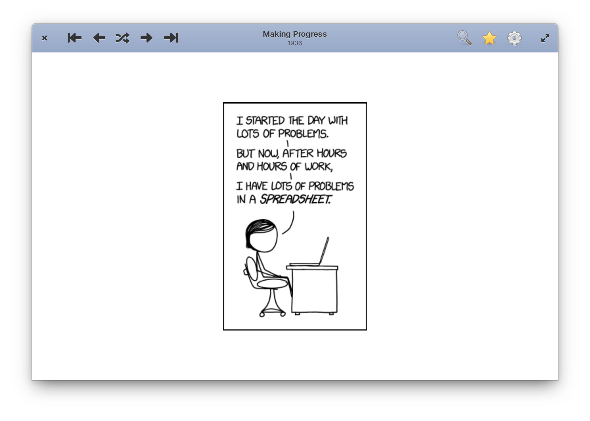

# Comic Sticks

Comic Sticks (`xkcd-gtk`) is a simple xkcd comic viewer written in Go using
GTK+3.



## Install

<a href="https://appcenter.elementary.io/com.github.rkoesters.xkcd-gtk"></a>
<a href="https://flathub.org/apps/details/com.github.rkoesters.xkcd-gtk"></a>

## Building from source

[](https://pkg.go.dev/github.com/rkoesters/xkcd-gtk@main/internal)
[](https://github.com/rkoesters/xkcd-gtk/actions/workflows/ci.yml)
[](https://goreportcard.com/report/github.com/rkoesters/xkcd-gtk)

### Requirements

To build this program, you will need Go (version >= 1.23, something like
`golang` or `go`) and GTK+ development files (version >= 3.20, something like
`libgtk-3-dev` or `gtk3-devel`).

### Building

Just run `make` from the root of the repo:

```shell
$ make
```

### Testing

Run tests with:

```shell
$ make test
```

#### Running static analysis

In addition to the regular build requirements, running static analysis requires the following tools:

- staticcheck (`go install honnef.co/go/tools/cmd/staticcheck@latest`)
- shellcheck (apt: `shellcheck`)
- xmllint (apt: `libxml2-utils`)
- yamllint (apt: `yamllint`)
- appstreamcli (apt: `appstream`)

Run static analysis with:

```shell
$ make check
```

### Installing from source

After you have compiled the application, you can install it.

To install for all users:

```shell
$ sudo make install prefix=/usr/local
```

To install for the current user only (you may need to add `$HOME/.local/bin` to
your `$PATH`):

```shell
$ make install prefix="$HOME/.local"
```

#### Uninstalling from source

To uninstall for all users:

```shell
$ sudo make uninstall prefix=/usr/local
```

To uninstall for the current user:

```shell
$ make uninstall prefix="$HOME/.local"
```

## License

This program comes with absolutely no warranty. See the [GNU General Public
License, version 3 or later](LICENSE) for details.
